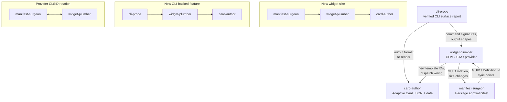

# ObsidianQuickNoteWidget — Repo-Specific Archetypes

Four custom Copilot CLI agents scoped to this repo's hard-won knowledge about the Widget Host / COM / WinRT / Adaptive Card / Obsidian-CLI / MSIX-manifest seam. They live in `.github/agents/` and are auto-discovered by Copilot CLI whenever you run it from inside this repo. They are **not** general-purpose — for tests, refactors, lint, docs, releases, perf, security, etc., use the user-level archetypes under `~/.copilot/agents/`. These four exist only because the layers below are booby-trapped and generic agents get them wrong.

## Quick picker

| Archetype | Owns this layer | When to invoke | When NOT | Model | Tools |
| --- | --- | --- | --- | --- | --- |
| **widget-plumber** | COM / WinRT activation, `IClassFactory`, `IWidgetProvider`, STA + native Win32 message pump, Widget Host interop | `Program.cs`, `Com/ClassFactory.cs`, `Com/Ole32.cs`, `Providers/ObsidianWidgetProvider.cs`; GUID sync; `MoAppHang`, `CO_E_*`, `E_NOINTERFACE`, silent non-activation | Card JSON edits, CLI surface work, pure-visual manifest edits | `claude-opus-4.7` | default |
| **card-author** | Adaptive Card JSON templates under `Core/AdaptiveCards/Templates/`, `CardTemplates.cs` constants, `CardDataBuilder.cs` data shape | New/edited card for a size; `${...}` bindings; `isVisible` flags; `widgetId` routing; `folderChoices` ordering; size-budget tuning | Provider activation, CLI probing, manifest XML | `claude-sonnet-4.6` | read, edit, execute, search, web |
| **cli-probe** | Read-only discovery of the live Obsidian CLI (`Obsidian.com`/`.exe`) surface | Verify a command signature, exact stdout/stderr, exit code, output format before code is written; re-verify after Obsidian updates | Editing widget/card/manifest code; web-sourced "documentation"; mutating the real vault | `claude-haiku-4.5` | read, execute, search |
| **manifest-surgeon** | `src/ObsidianQuickNoteWidget/Package.appxmanifest` — `<Definition>`s, size lists, `<com:ComServer>` CLSID, identity, capabilities, icons, `TargetDeviceFamily`, `Version` | Adding/removing sizes or definitions; CLSID rotation (manifest side); capability bumps; uninstall+reinstall dance | C#/WinRT code, card JSON, CLI behaviour | `claude-sonnet-4.6` | default |

## Why these exist

- **COM/WinRT activation is full of traps.** The STA must pump native `GetMessageW`/`TranslateMessage`/`DispatchMessageW` — any managed wait triggers PLM `MoAppHang`. `IClassFactory.CreateInstance` must return `WinRT.MarshalInspectable<IWidgetProvider>.FromManaged(_instance)`; a classic CCW from `Marshal.GetIUnknownForObject` fails QI for the WinRT IID and Widget Host silently drops the provider.
- **Adaptive Card JSON is renderer-picky.** Widget Host pins schema `1.5`, renders `$when` flakily (use `isVisible`), clips when size budgets are exceeded, and silently no-ops submits without `widgetId` in `data`.
- **Obsidian CLI syntax is positional `key=value`, not `--flag`.** `obsidian ls` doesn't exist. Guessing costs a build cycle; `cli-probe` verifies against the live binary.
- **`Package.appxmanifest` has four GUID sync points** (class `[Guid]`, `WidgetIdentifiers.ProviderClsid`, `<com:ComServer>`, `<WidgetProvider>`), and size/definition changes require a **full uninstall + reinstall** — upgrades preserve Widget Host's per-install size-list cache.

## How they compose

Most widget changes touch 2–3 of these archetypes. The coordination pattern:

## Boundary rules

- **widget-plumber** owns the provider, `IClassFactory`, COM lifecycle, STA/pump, and P/Invokes. It does **not** edit `Package.appxmanifest` (hands off to manifest-surgeon) and does **not** edit card JSON (hands off to card-author).
- **manifest-surgeon** edits **only** the manifest XML. When GUIDs change it enumerates the four sync points and hands the `.cs` edits off to widget-plumber; it never touches `.cs` itself.
- **card-author** edits **only** Adaptive Card JSON, `CardTemplates.cs` constants, and `CardDataBuilder.cs` data shape. It does **not** modify provider activation; it flags new templates for widget-plumber to dispatch.
- **cli-probe** is **observation-only**: it runs the Obsidian CLI against a scratch folder, captures verbatim output, and hands a surface report to widget-plumber / card-author. It never edits source, never mutates the real vault, and never consults web docs (the running binary is the source of truth).

## Pointer to the maintainer brief

For the full gotcha list, activation sequence diagram, and verified Obsidian CLI surface, read [`.github/copilot-instructions.md`](../copilot-instructions.md). These archetypes assume that brief as ground truth — don't duplicate it here.

## Local dev reminders

- After any manifest size or `<Definition>` change: **full `Remove-AppxPackage` + `Add-AppxPackage`** — upgrades leave Widget Host's cache stale. Pinned instances will be wiped.
- Tail `%LocalAppData%\ObsidianQuickNoteWidget\log.txt` on the first activation after every reinstall; silent non-activation is the default failure mode.
- Build / test / pack: `make build`, `make test`, `make pack`.
