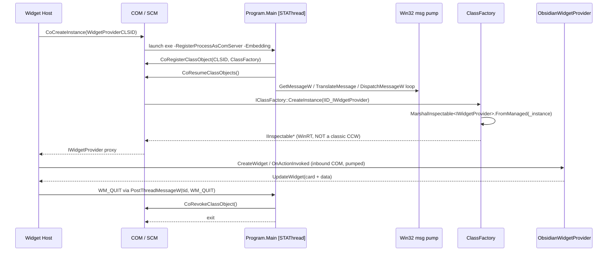

# Copilot instructions — Obsidian Quick Note Widget

Windows 11 Widget Board widget + WinForms tray companion that creates Obsidian notes via the official `obsidian` CLI. .NET 10, out-of-proc COM widget provider, MSIX-packaged.

## Build / test / run

Windows only. Commands run from the repo root. `make` works (GNU Make on Windows); plain `dotnet` works too.

```powershell
dotnet restore ObsidianQuickNoteWidget.slnx
dotnet build   ObsidianQuickNoteWidget.slnx -c Debug --nologo

# full test suite (xUnit, Core only)
dotnet test tests/ObsidianQuickNoteWidget.Core.Tests/ObsidianQuickNoteWidget.Core.Tests.csproj --nologo

# single test (xUnit --filter against FullyQualifiedName or DisplayName)
dotnet test tests/ObsidianQuickNoteWidget.Core.Tests/ObsidianQuickNoteWidget.Core.Tests.csproj `
  --filter "FullyQualifiedName~FilenameSanitizerTests.Sanitize_StripsReservedChars"

# MSIX (sideload build, unsigned)
dotnet publish src/ObsidianQuickNoteWidget/ObsidianQuickNoteWidget.csproj -c Release -p:Platform=x64 `
  -p:GenerateAppxPackageOnBuild=true -p:AppxPackageSigningEnabled=false `
  -p:AppxBundle=Always -p:UapAppxPackageBuildMode=SideloadOnly

# tray companion (normal .NET console)
dotnet run --project src/ObsidianQuickNoteTray
```

`TreatWarningsAsErrors=true` is set globally in `Directory.Build.props` — warnings fail the build. There is no lint target; `dotnet format` / `make format-check` is available but not wired into CI.

CI (`.github/workflows/build.yml`) runs restore → build Debug → test on `windows-latest`, and only publishes an MSIX when a `v*.*.*` tag is pushed.

## Reinstalling the MSIX during development

Widget Host aggressively caches widget definitions (icon, size list, CLSID). Updating an already-installed package often leaves stale cached metadata, so after changing `Package.appxmanifest` (especially sizes or definitions) you typically need a **full uninstall + reinstall**, not `Add-AppxPackage -Force*`. Also kill `Widgets.exe`, `WidgetService.exe`, `WebExperienceHost.exe`, `dasHost.exe`, and any running `ObsidianQuickNoteWidget.exe` before reinstalling.

Sideloaded builds require the dev cert to be trusted. Generate one with `.\tools\New-DevCert.ps1`; it writes `%LocalAppData%\ObsidianQuickNoteWidget\dev-cert\dev.pfx` (CN=`ObsidianQuickNoteWidgetDev`, 90-day validity) alongside a `password.txt` containing a freshly generated random 24-character password with a user-only ACL. The password is never printed or committed — sign MSIXes with `.\tools\Sign-DevMsix.ps1 <path>` which reads the file at runtime. The `dev-cert\` folder is git-ignored. `make pack-signed` is for real release certs only and refuses any `SIGNING_CERT` path under `dev-cert\`.

## Architecture

Four projects in `ObsidianQuickNoteWidget.slnx`:

| Project | Role |
| --- | --- |
| `src/ObsidianQuickNoteWidget.Core` | Headless logic library. `net10.0`, no Windows deps. `ObsidianCli`, `NoteCreationService`, sanitizers/validators, `JsonStateStore`, Adaptive Card templates + data builder. **All business logic lives here and is the only layer with tests.** |
| `src/ObsidianQuickNoteWidget` | Widget COM server. `net10.0-windows10.0.26100.0`, `WindowsPackageType=MSIX`, `WindowsAppSDKSelfContained=true`. Implements `IWidgetProvider` / `IWidgetProvider2`. |
| `src/ObsidianQuickNoteTray` | WinForms tray app with global `Ctrl+Alt+N` hotkey → popup that reuses `Core.NoteCreationService`. |
| `tools/AppExtProbe` | Diagnostic console that enumerates `AppExtensionCatalog.Open("com.microsoft.windows.widgets")` — used to verify the OS actually sees the widget registration, bypassing Widget Host cache. |

### Widget runtime flow

1. Widget Host launches `ObsidianQuickNoteWidget.exe -RegisterProcessAsComServer -Embedding` (out-of-proc COM).
2. `Program.Main` is **`[STAThread]`** and runs a **native Win32 `GetMessageW` loop** (see `src/ObsidianQuickNoteWidget/Com/Ole32.cs`). This is non-negotiable — see *Gotchas* below.
3. `SingletonClassFactory<T>.CreateInstance` returns a WinRT `IInspectable` via **`WinRT.MarshalInspectable<IWidgetProvider>.FromManaged(_instance)`** — not `Marshal.GetIUnknownForObject`. Classic CCWs fail QI for the WinRT `IWidgetProvider` IID and Widget Host silently rejects the provider.
4. `ObsidianWidgetProvider.PushUpdate(widgetId)` loads an Adaptive Card template (embedded JSON in `Core/AdaptiveCards/Templates/`) + builds a data JSON (`CardDataBuilder`), then calls `WidgetManager.GetDefault().UpdateWidget(...)`. Template choice is driven by `session.DefinitionId` and `session.Size`.
5. Per-widget state persists to `%LocalAppData%\ObsidianQuickNoteWidget\state.json` (`JsonStateStore`, atomic write via `.tmp` + `File.Move`). Unpackaged diagnostic log at `%LocalAppData%\ObsidianQuickNoteWidget\log.txt`; packaged log ends up under `%LocalAppData%\Packages\ObsidianQuickNoteWidget_h6cy8nh103fya\LocalCache\Local\...` (package family name is stable because the publisher is fixed in the manifest).

### Adaptive Cards

- Templates are `*.json` under `src/ObsidianQuickNoteWidget.Core/AdaptiveCards/Templates/`, embedded via `<EmbeddedResource Include="AdaptiveCards\Templates\*.json" />`. Load via `CardTemplates.Load(name)` / `CardTemplates.LoadForSize(size)`.
- **Template naming matters**: `QuickNote.{small,medium,large}.json` are all for the **QuickNote** widget; the **RecentNotes** widget uses the separate `RecentNotes.json`. `PushUpdate` dispatches on `WidgetIdentifiers.RecentNotesWidgetId` for this.
- Data JSON is built by `CardDataBuilder.BuildQuickNoteData(state, showAdvanced)`. If you add a new `${$root.whatever}` binding in a template, add the field to the `JsonObject` there too.
- Cards use AC Templating (`$data`, `$when`, `$root`) — this is evaluated by the Widget Host's renderer before display, not by us.

## Key conventions

- **IDs are hard-coded and must stay in sync across four places**: CLSID in `WidgetIdentifiers.ProviderClsid`, `Package.appxmanifest` (`com:Class Id=` and `CreateInstance ClassId=`), and the widget definition IDs (`WidgetIdentifiers.QuickNoteWidgetId` / `RecentNotesWidgetId`) match `<Definition Id=...>` in the manifest.
- **No Windows types in `Core`.** Tests mock `IObsidianCli` / `IStateStore` / `ILog`. Keep the seam clean — if you find yourself wanting `System.Windows.*` in `Core`, the logic belongs in the widget or tray project.
- **`internal` is fine for library code**: `Core` exposes internals to tests via `<InternalsVisibleTo Include="ObsidianQuickNoteWidget.Core.Tests" />`.
- **Widget code must never throw out to Widget Host.** `ObsidianWidgetProvider` catches inside action handlers and writes to status via `WriteStatus` + `PushUpdate`. State persistence swallows exceptions on purpose — "widget must never crash over state persistence".
- **CLI surface is an abstraction seam.** `ObsidianCli` is the only place that shells out to `obsidian`. Do not spread `Process.Start("obsidian", ...)` calls elsewhere.

## Obsidian CLI — verified surface (Obsidian 1.12+)

Probed against a live Obsidian 1.12 install. Keep `ObsidianCli` aligned with this — previous revisions of the docs/code guessed at `--flag` syntax and `obsidian ls`; both are wrong.

- **Executable:** `C:\Program Files\Obsidian\Obsidian.com` (also `Obsidian.exe` — same binary). Discovered via `PATH` after the user runs *Settings → General → Command Line Interface → Register CLI*.
- **Invocation shape:** `obsidian <command> [key=value ...]`. Arguments are **positional `key=value` tokens, NOT `--flags`**. Quote values containing spaces: `name="My Note"`. Inside `content=` values, use literal `\n` for newline and `\t` for tab — `content=` is an inline arg, not stdin.

Commands used by this project:

| Command | Output / effect |
| --- | --- |
| `obsidian vault info=path` | Single line: absolute fs path of the active vault. |
| `obsidian vault` | TSV key/value lines: `name<TAB>…`, `path<TAB>…`, `files<TAB>n`, `folders<TAB>n`, `size<TAB>n`. |
| `obsidian folders` | All vault folders, one per line, forward-slash separated; vault root is `/`. **Use this, not `ls`.** |
| `obsidian create name=<name> path=<vault-relative> content=<text> [template=<name>] [overwrite] [open] [newtab]` | Creates a note. `content` is an argument. |
| `obsidian open path=<vault-relative> [newtab]` or `obsidian open file=<name>` | Opens a note in Obsidian. |
| `obsidian daily:append content=<text> [inline] [open] [paneType=tab\|split\|window]` | Appends to today's daily note. |

Also available (mention only): `obsidian daily:path`, `obsidian delete file=|path=`, `obsidian vaults [verbose]`.

**Gotcha:** `obsidian ls` does **not** exist — the CLI returns `Command "ls" not found`. Any historical code or docs referencing `obsidian ls` / `obsidian ls --dirs-only` are stale; folders come from `obsidian folders` (or a filesystem fallback rooted at `vault info=path`).

## Widget activation sequence

This is the flow Widget Host drives on pin/activation. The sharp edges here have all been hit at least once — respect them.



Non-negotiable rules:

- **Classes must marshal as WinRT IInspectable.** `CreateInstance` returns `MarshalInspectable<IWidgetProvider>.FromManaged(_instance)`. `Marshal.GetIUnknownForObject` produces a classic CCW that fails QI for the WinRT `IWidgetProvider` IID → Widget Host silently drops the provider.
- **`[STAThread]` `Main` MUST pump native Win32 messages.** Use `GetMessageW` / `TranslateMessage` / `DispatchMessageW`. Any managed wait (`ManualResetEvent.Wait()`, `Thread.Sleep`, `Task.Delay`, `await Task.WhenAny(...)`) blocks the STA and Widget Host's inbound COM calls deadlock. PLM then raises `MoAppHang` within ~5 s and kills the process. Shutdown via `PostThreadMessageW(tid, WM_QUIT, 0, 0)` or `PostQuitMessage(0)`.
- **Registration bracket:** `CoRegisterClassObject` before the pump, `CoResumeClassObjects` to unblock calls, `CoRevokeClassObject` after the pump exits.
- **`GetCurrentThreadId` is in `kernel32.dll`, not `user32.dll`.** Wrong P/Invoke loads fine but throws `EntryPointNotFoundException` on first use.
- **Manifest `TargetDeviceFamily MinVersion ≥ 10.0.22621.0`** and csproj `TargetPlatformMinVersion` must match. Widget Host silently filters providers with lower min versions.
- **Every `<Definition>` in `Package.appxmanifest` needs `<Screenshots>` plus `<ThemeResources>` containing (at minimum) empty `<DarkMode />` and `<LightMode />` elements**, or the definition will not appear in the picker.
- **Widget Host caches the size list per-install.** After any manifest change that touches sizes or definitions, do a **full uninstall + reinstall** — `Add-AppxPackage -ForceApplicationShutdown -ForceUpdateFromAnyVersion` leaves stale cached metadata. Note this wipes pinned instances. Also kill `Widgets.exe`, `WidgetService.exe`, `WebExperienceHost.exe`, `dasHost.exe`, and any lingering `ObsidianQuickNoteWidget.exe` before reinstalling.

## Gotchas (learned the hard way)

- **See the *Widget activation sequence* section above for the full set of COM / STA / manifest rules** — they're all load-bearing.
- **Tests never run the packaged widget.** There is no UI test harness — tests exercise `Core` only. If you touch COM, widget registration, or the message loop, validate by building+signing+installing the MSIX and watching `log.txt`.

## Where things live (non-obvious)

- `src/ObsidianQuickNoteWidget/Com/ClassFactory.cs` — WinRT `IInspectable` marshalling (most bug-prone file in the repo).
- `src/ObsidianQuickNoteWidget/Com/Ole32.cs` — all `Ole32` / `User32` / `Kernel32` P/Invokes; add new ones here.
- `src/ObsidianQuickNoteWidget/Providers/ObsidianWidgetProvider.cs` — the only `IWidgetProvider` implementation; all verbs dispatched from `HandleVerbAsync`.
- `src/ObsidianQuickNoteWidget.Core/Notes/NoteCreationService.cs` — the note-creation pipeline (title sanitization → folder validation → frontmatter → duplicate filename resolution → CLI invocation). Changes here should be covered by tests in `tests/ObsidianQuickNoteWidget.Core.Tests/NoteCreationServiceTests.cs`.
