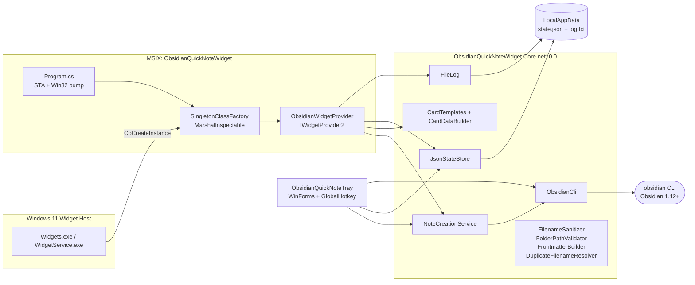
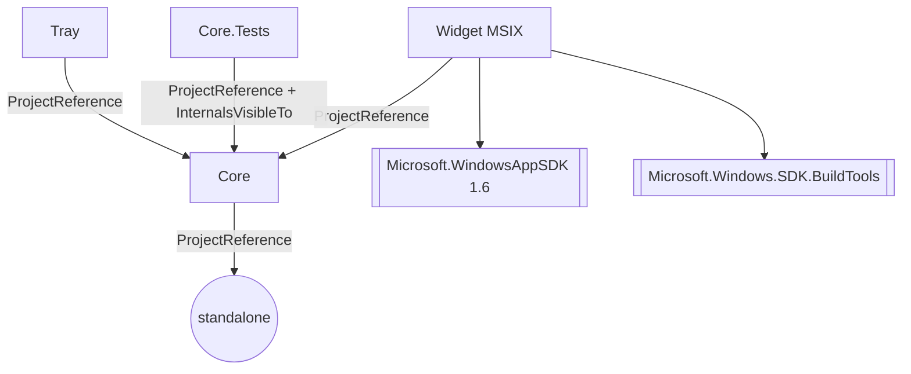

# Code Archaeologist — Onboarding Brief: Obsidian Quick Note Widget

> **Archetype:** `code-archaeologist` (read-only, one-shot handoff).
> **Target:** `C:\Users\lafia\csharp\obsidian_widget` at the working-tree state of this sweep.
> **Stack:** .NET 10 (`Directory.Build.props:4`), Windows 11 22H2+, MSIX-packaged out-of-proc COM widget provider + WinForms tray companion.

## 1. Overview

A Windows 11 **Widget Board** provider that creates Obsidian notes without opening Obsidian, plus a WinForms tray companion with a global hotkey for keyboard-first capture. It talks to Obsidian solely through the official `obsidian` CLI shipped in Obsidian 1.12+ (`README.md:29-37`). Packaged as an out-of-proc COM server inside an MSIX (`src/ObsidianQuickNoteWidget/ObsidianQuickNoteWidget.csproj:4-14`), self-contained Windows App SDK.

## 2. Scope of this brief

Whole-repo sweep. Covers the three source projects, the xUnit test project, and the two helper tools. Intentionally **not** inspected: individual Adaptive Card JSON templates (listed only), the `tools/WidgetCatalogProbe.cs` script body, CI workflow internals, and the contents of `bin/obj` build outputs. See §11.

## 3. Architecture diagram

## 4. Entry points

| File:line | What it starts |
| --- | --- |
| `src/ObsidianQuickNoteWidget/Program.cs:16` | Widget COM server `Main` — `[STAThread]`, `CoRegisterClassObject` + `CoResumeClassObjects`, then a native `GetMessageW` pump (`Program.cs:82-88`). Defaults to COM-server mode even without `-RegisterProcessAsComServer` (`Program.cs:110-111`). |
| `src/ObsidianQuickNoteTray/Program.cs:15` | Tray app `Main` — `[STAThread]`, wires `NotifyIcon` + `GlobalHotkey(Ctrl+Alt+N)` + `QuickNoteForm`, runs `Application.Run()` (`Program.cs:64`). |
| `tools/AppExtProbe/Program.cs` | Diagnostic console that queries `AppExtensionCatalog.Open("com.microsoft.windows.widgets")` (per `.github/copilot-instructions.md:48`). |
| `tools/WidgetCatalogProbe.cs` | Stand-alone widget catalog probe (see §11). |
| MSIX COM activation: `Package.appxmanifest:42-50` | `com:ExeServer` + `Arguments="-RegisterProcessAsComServer"` maps CLSID `B3E8F4D4-…` to `ObsidianQuickNoteWidget.exe`. |
| Widget extension: `Package.appxmanifest:53-66` | `windows.appExtension` `com.microsoft.windows.widgets` + `<CreateInstance ClassId="B3E8F4D4-…"/>`. |

## 5. Module map

**`src/ObsidianQuickNoteWidget.Core/`** (`net10.0`, no Windows deps — the only tested layer; `ObsidianQuickNoteWidget.Core.csproj:4-16`)

- `Cli/IObsidianCli.cs:8` — CLI seam: `IsAvailable`, `RunAsync`, `GetVaultRootAsync`, `ListFoldersAsync`, `CreateNoteAsync`, `OpenNoteAsync`, `AppendDailyAsync`.
- `Cli/ObsidianCli.cs:14` — Process-based implementation; resolves `obsidian.exe|cmd|bat` on `PATH` (`ObsidianCli.cs:157-171`); 30 s default timeout (`:17`); logs via `ILog`.
- `Cli/ObsidianCliParsers.cs:8` — Pure string transforms: `ParseVaultPath`, `ParseFolders` (strips `/`, dot-dirs, dedup case-insensitive), `EscapeContent` (`\` first, then `\r\n`/`\n`/`\r`/`\t`).
- `Cli/CliResult.cs:3` — `record (ExitCode, StdOut, StdErr, Duration)` with `Succeeded`.
- `Notes/NoteRequest.cs:3` — Immutable DTO (title, folder, body, tagsCsv, template, three toggles) + `NoteCreationStatus` enum (`:13`) + `NoteCreationResult` (`:23`).
- `Notes/NoteCreationService.cs:11` — The pipeline: sanitize → validate folder → frontmatter → duplicate-filename resolve → CLI invoke → optional open (`:24-89`). Short-circuits into `AppendDailyAsync` when `AppendToDaily` is set (`:32-45`).
- `Notes/FilenameSanitizer.cs:13` — Strips illegal chars (`:7-10`), trims trailing `.`/` `, caps at 120, prefixes reserved names (CON/PRN/AUX/NUL/COM1-9/LPT1-9) with `_`.
- `Notes/FolderPathValidator.cs` — Normalizes + validates vault-relative folder.
- `Notes/FrontmatterBuilder.cs:9` — YAML frontmatter block (`created`, `tags`), no fence when empty (`:18`); YAML-quotes on trigger chars (`:11-12`).
- `Notes/DuplicateFilenameResolver.cs:7` — Appends `-2`, `-3` … up to 1000, then a millisecond timestamp fallback (`:30`).
- `Notes/NoteTemplates.cs:3-32` — `Blank|Daily|Meeting|Book|Idea` seed bodies + implicit tags.
- `State/IStateStore.cs:3` — `Get/Save/Delete(widgetId)` seam.
- `State/JsonStateStore.cs:9` — `%LocalAppData%\ObsidianQuickNoteWidget\state.json`, atomic write via `.tmp` + `File.Move` (`:76-89`), `lock`-protected (`:18`), clone-on-read/write via JSON round-trip (`:91-92`).
- `State/WidgetState.cs:4` — Per-widget persisted fields incl. cached folders, recent folders/notes.
- `AdaptiveCards/CardTemplates.cs:6` — Embedded resource loader; `LoadForSize` dispatches small/medium/large (`:27-32`). JSON templates under `AdaptiveCards/Templates/*.json` embedded via `<EmbeddedResource>` (`.csproj:11`).
- `AdaptiveCards/CardDataBuilder.cs:11` — Builds the data JSON bound against the template (inputs, folder choices 📌/🕑/other, status, recents).
- `Logging/ILog.cs:3` + `NullLog:10` / `Logging/FileLog.cs:7` — Rolling file log (1 MB roll, `:11`), swallows all I/O errors (`:28-42`).

**`src/ObsidianQuickNoteWidget/`** (`net10.0-windows10.0.26100.0`, `WindowsPackageType=MSIX`, `WindowsAppSDKSelfContained=true`; `.csproj:5-14`)

- `Program.cs:16` — COM-server entry (see §4). Writes a "proof-of-life" log to `%UserProfile%\ObsidianWidget-proof.log` bypassing package redirection (`:20-28`).
- `Com/ClassFactory.cs:19` — `IClassFactory` COM interface + `SingletonClassFactory<T>` (`:30`) that **returns a WinRT `IInspectable` via `MarshalInspectable<IWidgetProvider>.FromManaged`** (`:50`) — **not** a classic CCW.
- `Com/Ole32.cs:6` — P/Invokes: `CoRegisterClassObject` (DllImport — `LibraryImport` rejects IUnknown-marshalled `object`, `:14-22`), `CoResumeClassObjects`, `CoRevokeClassObject`, `GetMessageW`/`TranslateMessage`/`DispatchMessageW`, `PostThreadMessageW`, `GetCurrentThreadId` in **kernel32** (`:56-57`).
- `Providers/ObsidianWidgetProvider.cs:19` — The single `IWidgetProvider` / `IWidgetProvider2` implementation. Maintains a `ConcurrentDictionary<string, WidgetSession>` (`:25`) plus a 2-minute `Timer` that refreshes folder caches for all active widgets (`:30-31, :261-283`). Dispatches verbs `createNote | pasteClipboard | toggleAdvanced | recheckCli | openRecent | openVault` (`:125-153`).
- `WidgetIdentifiers.cs:8` — `ProviderClsid = "B3E8F4D4-3E9B-4A5E-9F3A-1F2E7B6A2C91"`, widget IDs `ObsidianQuickNote` / `ObsidianRecentNotes`.
- `Package.appxmanifest` — COM server reg + widget AppExtension. See §8.
- `WidgetsDefinition.xml` — Legacy-looking standalone definitions file; see *Gotchas*.

**`src/ObsidianQuickNoteTray/`** (`net10.0-windows`, `UseWindowsForms=true`; `.csproj:5-7`)

- `Program.cs:15` — wires hotkey + notify icon + form (see §4); pops a `ShowBalloonTip` when CLI is missing (`:55-60`).
- `GlobalHotkey.cs:7` — `NativeWindow` subclass, `RegisterHotKey`/`UnregisterHotKey`, `WM_HOTKEY = 0x0312` (`:8, :37-41`), fixed hotkey id `0x9001` (`:29`).
- `QuickNoteForm.cs:13` — Popup form. Reuses `NoteCreationService` so the tray and widget produce identical notes (`:15-16, :107-133`). Uses `StateKey = "tray"` as its widgetId in the shared store (`:14`). Ctrl+Enter = Create, Esc = Hide (`:56-57`).

**`tests/ObsidianQuickNoteWidget.Core.Tests/`** — xUnit per-type: `CardDataBuilderTests`, `CardTemplatesTests`, `DuplicateFilenameResolverTests`, `FilenameSanitizerTests`, `FolderPathValidatorTests`, `FrontmatterBuilderTests`, `JsonStateStoreTests`, `NoteCreationServiceTests`, `ObsidianCliParsersTests` (see directory listing). No UI/COM tests.

**`tools/`** — `AppExtProbe/` console + `WidgetCatalogProbe.cs`; both are diagnostic: they verify the OS sees the widget registration independent of Widget Host cache (`.github/copilot-instructions.md:48`).

## 6. Reference graph

Sources: `ObsidianQuickNoteWidget.Core.csproj:15`, `ObsidianQuickNoteWidget.csproj:24-31`, `ObsidianQuickNoteTray.csproj:16-18`, `ObsidianQuickNoteWidget.slnx:1-12`.

## 7. Canonical user journey — "pin widget → click Create"

Trace each hop with `file:line`:

1. **User opens Widget Board (⊞+W), picks "Obsidian Quick Note".** Widget Host calls `CoCreateInstance` on CLSID `B3E8F4D4-…`, which the OS resolves to `ObsidianQuickNoteWidget.exe -RegisterProcessAsComServer` via `Package.appxmanifest:44-48`.
2. **Process launches.** `Program.Main` writes proof-of-life (`src/ObsidianQuickNoteWidget/Program.cs:20-28`), constructs `ObsidianWidgetProvider` (`:41`), and registers the class factory:
   - `CoRegisterClassObject(clsid, SingletonClassFactory, CLSCTX_LOCAL_SERVER, REGCLS_MULTIPLEUSE|REGCLS_SUSPENDED)` (`Program.cs:45-50`)
   - `CoResumeClassObjects()` (`:58`)
3. **Pump starts.** `Program.cs:82-88` runs the `GetMessageW` → `TranslateMessage` → `DispatchMessageW` loop. STA-correct, no managed waits.
4. **Class factory QI.** `SingletonClassFactory.CreateInstance` (`Com/ClassFactory.cs:43-55`) accepts QI for `IWidgetProvider.GUID` or `IID_IUnknown` and returns `MarshalInspectable<IWidgetProvider>.FromManaged(_instance)` (`:50`).
5. **`CreateWidget` inbound.** `ObsidianWidgetProvider.CreateWidget` (`Providers/ObsidianWidgetProvider.cs:51-63`) persists `WidgetState.Size`, records a `WidgetSession`, fires `RefreshFolderCacheAsync` (→ `ObsidianCli.ListFoldersAsync` → `obsidian folders`, `Cli/ObsidianCli.cs:109-125`), and calls `PushUpdate`.
6. **Initial render.** `PushUpdate` (`ObsidianWidgetProvider.cs:293-332`):
   - If CLI missing → `CardTemplates.Load("CliMissing.json")` + `CardDataBuilder.BuildCliMissingData(...)` (`:303-307`).
   - Else QuickNote size-specific template via `CardTemplates.LoadForSize(session.Size)` (`AdaptiveCards/CardTemplates.cs:27-32`) + `CardDataBuilder.BuildQuickNoteData(state, showAdvanced)` (`AdaptiveCards/CardDataBuilder.cs:13-44`).
   - `WidgetManager.GetDefault().UpdateWidget(options)` (`ObsidianWidgetProvider.cs:326`).
7. **User types a title + clicks Create.** Adaptive Card `Action.Execute` verb `createNote` with bound `inputs` JSON fires `IWidgetProvider.OnActionInvoked`.
8. **`OnActionInvoked`** (`ObsidianWidgetProvider.cs:72-90`) schedules `HandleVerbAsync(session, "createNote", data)`.
9. **`CreateNoteAsync`** (`ObsidianWidgetProvider.cs:155-223`):
   - Parses JSON inputs (`:341-361`), merges with persisted defaults and any pending paste (`:169-175`).
   - Builds a `NoteRequest` (`Notes/NoteRequest.cs:3`) and awaits `_notes.CreateAsync` (`:187`).
10. **`NoteCreationService.CreateAsync`** (`Core/Notes/NoteCreationService.cs:24-89`):
    - `IsAvailable` guard (`:28-30`).
    - AutoDatePrefix (`:48`) → `FilenameSanitizer.Sanitize` (`:50` → `Notes/FilenameSanitizer.cs:13-33`).
    - `FolderPathValidator.Validate` (`:54`).
    - Tags = CSV + template tags (`:60-63`, `NoteTemplates.Tags`).
    - `BuildBody` → `NoteTemplates.SeedBody` + user body + `FrontmatterBuilder.Build` (`:91-102`, `Notes/FrontmatterBuilder.cs:14`).
    - `IObsidianCli.GetVaultRootAsync` (`:67`) — runs `obsidian vault info=path` (`Cli/ObsidianCli.cs:96-107`).
    - `DuplicateFilenameResolver.ResolveUnique` with `File.Exists` probe against the resolved vault root (`:68-75`).
    - `IObsidianCli.CreateNoteAsync` (`:77`) → shells `obsidian create path=<rel> content=<escaped>` (`Cli/ObsidianCli.cs:127-139`, escape at `Cli/ObsidianCliParsers.cs:54-63`).
    - If `OpenAfterCreate` → `obsidian open path=…` fire-and-forget (`:82-85`).
11. **State write-back** (`ObsidianWidgetProvider.cs:189-215`): update `LastFolder`, toggles, `RecentNotes`/`RecentFolders` (cap 16/8, `:198-199, :334-339`), `LastStatus`/`LastError`, atomically persisted (`State/JsonStateStore.cs:76-89`).
12. **Re-render.** `PushUpdate` at `:152` then again at `:221` (post-create folder refresh) sends a new Adaptive Card reflecting the success banner.

## 8. Data & state

- **On-disk state (read/written by both Widget and Tray):** `%LocalAppData%\ObsidianQuickNoteWidget\state.json` — dictionary `widgetId → WidgetState` (`State/JsonStateStore.cs:9-30`, `State/WidgetState.cs:4-22`). Tray uses the fixed key `"tray"` (`QuickNoteForm.cs:14`). Packaged builds are redirected under `%LocalAppData%\Packages\ObsidianQuickNoteWidget_<pfn>\LocalCache\Local\…` (`README.md:75-76`).
- **Log file:** `%LocalAppData%\ObsidianQuickNoteWidget\log.txt`, rolled at 1 MB → `log.txt.1` (`Logging/FileLog.cs:19-56`).
- **Proof-of-life probe:** `%UserProfile%\ObsidianWidget-proof.log` — deliberately outside package redirection to confirm Widget Host actually launched the exe (`Program.cs:22-27`).
- **Embedded resources:** five Adaptive Card JSON templates under `src/ObsidianQuickNoteWidget.Core/AdaptiveCards/Templates/` (`CliMissing.json`, `QuickNote.small.json`, `QuickNote.medium.json`, `QuickNote.large.json`, `RecentNotes.json`) — embedded via `<EmbeddedResource Include="AdaptiveCards\Templates\*.json" />` (`Core.csproj:11`).
- **MSIX manifest:** `src/ObsidianQuickNoteWidget/Package.appxmanifest`. Min target family `10.0.22621.0` (`:23`), `runFullTrust` capability (`:120`), publisher `CN=ObsidianQuickNoteWidgetDev` (`:13`).
- **No database, no queue, no network.** `ObsidianCli.RunAsync` is the only IPC boundary, shelling the `obsidian` executable (`Cli/ObsidianCli.cs:41-93`).

## 9. Key abstractions (seam table)

| Abstraction | File:line | Purpose / swap point |
| --- | --- | --- |
| `IObsidianCli` | `Core/Cli/IObsidianCli.cs:8` | Only boundary to `obsidian.exe`. Tests inject a fake. |
| `IStateStore` | `Core/State/IStateStore.cs:3` | Per-widget JSON persistence. |
| `ILog` + `NullLog` | `Core/Logging/ILog.cs:3` | Local-only diagnostic log; never throws. |
| `NoteCreationService` | `Core/Notes/NoteCreationService.cs:11` | The single create-pipeline reused by widget + tray. |
| `CardDataBuilder` + `CardTemplates` | `Core/AdaptiveCards/*.cs` | Pure data/template split; template is static, data is per-render. |
| `SingletonClassFactory<T>` | `Widget/Com/ClassFactory.cs:30` | WinRT-aware COM factory. Critical invariant at `:50`. |
| `WidgetSession` | `Widget/Providers/ObsidianWidgetProvider.cs:382` | Per-pinned-widget in-memory state (size, paste buffer, advanced toggle). |

## 10. Gotchas

Every one of these is load-bearing — the repo's `.github/copilot-instructions.md:124-132` codifies them as "non-negotiable rules". Verified against source:

1. **STA + native Win32 pump is mandatory.** `Program.cs:15` is `[STAThread]`; the pump at `Program.cs:82-88` uses `GetMessageW`/`TranslateMessage`/`DispatchMessageW`. Any managed wait on that thread deadlocks Widget Host's inbound COM calls, and Windows PLM kills the process with `MoAppHang` within ~5 s (comment at `Program.cs:69-71`). Shutdown is by `PostThreadMessageW(tid, WM_QUIT, …)` (`:77, :75-80`).
2. **WinRT marshalling, not classic CCW.** `SingletonClassFactory.CreateInstance` returns `MarshalInspectable<IWidgetProvider>.FromManaged` (`Com/ClassFactory.cs:50`). `Marshal.GetIUnknownForObject` would fail QI for the WinRT `IWidgetProvider` IID and Widget Host would silently reject the provider (comment at `Com/ClassFactory.cs:8-15`).
3. **4-GUID / ID sync.** The CLSID `B3E8F4D4-3E9B-4A5E-9F3A-1F2E7B6A2C91` is duplicated in: `WidgetIdentifiers.cs:8`, `Package.appxmanifest:47` (`com:Class Id`), and `Package.appxmanifest:66` (`CreateInstance ClassId`). Additionally the two widget definition IDs (`ObsidianQuickNote`, `ObsidianRecentNotes`) are duplicated in `WidgetIdentifiers.cs:11-12`, `Package.appxmanifest:69, :90`, **and** in the parallel `WidgetsDefinition.xml:3, :27`. All must be kept in lock-step or Widget Host silently drops the provider.
4. **`WidgetsDefinition.xml` mismatch.** This file declares different size capabilities than the shipping manifest — QuickNote has `small, medium` only (`WidgetsDefinition.xml:9-15`) while the actual manifest declares `small, medium, large` (`Package.appxmanifest:73-77`); RecentNotes has `large` only (`WidgetsDefinition.xml:32-35`) vs `medium, large` in the manifest (`:94-97`). It is not referenced from `ObsidianQuickNoteWidget.csproj` and looks vestigial — do not edit it thinking it changes anything.
5. **Manifest uninstall-dance.** Widget Host caches widget definitions per-install. Any manifest change touching sizes or `<Definition>` elements requires a full uninstall+reinstall; `Add-AppxPackage -ForceApplicationShutdown -ForceUpdateFromAnyVersion` leaves stale metadata (`README.md:76-78`; `.github/copilot-instructions.md:132`). Also kill `Widgets.exe`, `WidgetService.exe`, `WebExperienceHost.exe`, `dasHost.exe`, and any running `ObsidianQuickNoteWidget.exe` before reinstalling (`README.md:78`).
6. **CLI surface is positional `key=value`, not `--flags`.** `obsidian create path=<rel> content=<escaped>`, never `--path`. Verified against the live CLI (`.github/copilot-instructions.md:80-93`); encoded in `Cli/ObsidianCli.cs:127-155`.
7. **`content=` escaping order matters.** Backslashes must be doubled **first**, then CR/LF/TAB replaced with literal `\n`/`\t` — otherwise the double-escape introduces `\\n` where the user meant a newline (`Cli/ObsidianCliParsers.cs:48-63`).
8. **`obsidian ls` does not exist.** Historical code paths using `obsidian ls` / `--dirs-only` are wrong; use `obsidian folders` (`.github/copilot-instructions.md:93`). Only `ObsidianCli.ListFoldersAsync` is the sanctioned path (`Cli/ObsidianCli.cs:109-125`).
9. **`GetCurrentThreadId` is in `kernel32.dll`, not `user32.dll`.** Wrong P/Invoke loads fine but throws `EntryPointNotFoundException` on first use (`Com/Ole32.cs:56-57`; rule at `.github/copilot-instructions.md:129`).
10. **P/Invoke mixing.** `CoRegisterClassObject` deliberately stays on `[DllImport]` with `#pragma warning disable SYSLIB1054` because the source-generated `[LibraryImport]` marshaller doesn't support the IUnknown-marshalled `object` parameter (`Com/Ole32.cs:12-22`).
11. **`Platforms` = `x64;x86;arm64`, `TargetPlatformMinVersion = 10.0.22621.0`** (`ObsidianQuickNoteWidget.csproj:9, :6`). Manifest `MinVersion` must match or Widget Host filters out the provider (`.github/copilot-instructions.md:130`).
12. **Widget provider must never throw out.** `OnActionInvoked` (`ObsidianWidgetProvider.cs:78-89`), the folder refresh (`:244-254`), and `PushUpdate` (`:295-331`) all catch & surface errors via status lines; state persistence swallows errors intentionally — "widget must never crash over state persistence" (`JsonStateStore.cs:85-89`, rationale at `.github/copilot-instructions.md:70`).
13. **`TreatWarningsAsErrors=true` globally** (`Directory.Build.props:5`). A harmless warning in new code fails the build. Selectively silenced: `CA1416;CS8981` in Widget (`.csproj:21`), `CA1416;CA2000` in Tray (`.csproj:13`), `CA1852` globally (`Directory.Build.props:10`).
14. **Tests cover `Core` only.** There is no UI/COM test harness (`.github/copilot-instructions.md:137`). Any change touching `Program.cs`, `Com/*`, or the manifest must be validated by building+signing+installing the MSIX and watching `log.txt` + `ObsidianWidget-proof.log`.
15. **Tray & Widget share one JSON file.** If the tray is running while the widget persists state, both writers rely on the `lock (_gate)` inside their respective `JsonStateStore` instances — but they are **separate processes** and the lock doesn't cross the process boundary. Atomic `.tmp` + `File.Move` (`JsonStateStore.cs:80-83`) reduces corruption risk but last-writer-wins races between tray (`"tray"` key) and widget (widgetId keys) remain. In practice they write disjoint keys so this is latent.

## 11. Tech-debt register

A full grep for `TODO|FIXME|HACK|XXX|Obsolete|@deprecated|workaround` outside `bin/obj` returned **zero matches** — this codebase carries no written-out tech-debt markers. Implicit debt noted during the sweep:

- `src/ObsidianQuickNoteWidget/WidgetsDefinition.xml` — not referenced by the csproj, contents disagree with `Package.appxmanifest` (see Gotcha 4). Likely leftover from an earlier design; a candidate for deletion.
- `src/ObsidianQuickNoteWidget/Program.cs:110-111` — `IsComServerMode` always returns `true` after the switch-scan falls through ("this exe has no other purpose"). Dead branch for non-COM invocation.
- `src/ObsidianQuickNoteWidget/Program.cs:19-28` — proof-of-life log writer is explicitly debug scaffolding ("bypassing package redirection so we can confirm Widget Host actually launched us"). Should be feature-flagged or removed for a release build.
- `src/ObsidianQuickNoteWidget/Com/Ole32.cs:14` — `#pragma warning disable SYSLIB1054` on `CoRegisterClassObject`. Will stay until the source-gen marshaller supports IUnknown-`object`.
- `src/ObsidianQuickNoteWidget/Providers/ObsidianWidgetProvider.cs:30-47` — `Timer` has no explicit dispose; relies on process termination. Fine in this COM-host shape but brittle if the class is ever reused outside the widget host.
- `src/ObsidianQuickNoteWidget.Core/State/JsonStateStore.cs:91-92` — `Clone` via JSON round-trip on every `Get`/`Save`. Simple and correct; will become a hotspot if state ever grows.
- `src/ObsidianQuickNoteWidget.Core/Logging/FileLog.cs:28-42` — catch-all `catch {}` by design. Makes log-path misconfiguration invisible.
- `src/ObsidianQuickNoteTray/GlobalHotkey.cs:29` — fixed hotkey id `0x9001` and no user-configurable binding; `Program.cs:42-53` hard-codes `Ctrl+Alt+N`.
- `tools/WidgetCatalogProbe.cs` / `tools/AppExtProbe/` — diagnostic scripts not wired into the solution. Useful but undocumented beyond `.github/copilot-instructions.md:48`.

## 12. Recommended reading order (day 1)

1. `README.md` — product shape and install/uninstall ritual.
2. `.github/copilot-instructions.md` — the authoritative maintainer brief; re-reads §"Widget activation sequence" and "Gotchas" are the highest-leverage pages in the repo.
3. `src/ObsidianQuickNoteWidget.Core/Cli/IObsidianCli.cs` then `Cli/ObsidianCli.cs` + `Cli/ObsidianCliParsers.cs` — understand the one IPC boundary first.
4. `src/ObsidianQuickNoteWidget.Core/Notes/NoteRequest.cs` → `Notes/NoteCreationService.cs` — the central pipeline, referenced by every UI.
5. `src/ObsidianQuickNoteWidget.Core/State/WidgetState.cs` → `State/JsonStateStore.cs` — the only persisted data.
6. `src/ObsidianQuickNoteWidget.Core/AdaptiveCards/CardTemplates.cs` + `CardDataBuilder.cs` — template/data split.
7. `src/ObsidianQuickNoteWidget/WidgetIdentifiers.cs` — then open `Package.appxmanifest` in parallel to see where each ID lands.
8. `src/ObsidianQuickNoteWidget/Com/Ole32.cs` → `Com/ClassFactory.cs` → `Program.cs` — the COM hosting sandwich, in that order.
9. `src/ObsidianQuickNoteWidget/Providers/ObsidianWidgetProvider.cs` — dispatch, state write-back, folder refresh timer.
10. `src/ObsidianQuickNoteTray/Program.cs` → `GlobalHotkey.cs` → `QuickNoteForm.cs` — the minimalist sibling UI.
11. `tests/ObsidianQuickNoteWidget.Core.Tests/NoteCreationServiceTests.cs` — see how the seams are driven; every other test file is smaller and follows the same pattern.
12. `Makefile` — what the dev loop looks like day-to-day.

## 13. What I did not inspect

- The **Adaptive Card JSON templates themselves** (`Core/AdaptiveCards/Templates/*.json`) — only confirmed their existence and names. Their binding surface is implicit in `CardDataBuilder` output.
- **`tools/WidgetCatalogProbe.cs` body** and the `tools/AppExtProbe/Program.cs` body — only their role per `.github/copilot-instructions.md:48` and file names.
- **`.github/workflows/*`** — noted existence only; CI behavior is summarized from `.github/copilot-instructions.md:31`.
- **Every test method body** — I listed the test files but did not walk individual assertions.
- **`winget/` directory** — noted existence at the repo root (distribution manifest, not code).
- **Generated `bin/`/`obj/`** — excluded by design.
- **Live Obsidian CLI behavior** — all CLI claims are cross-referenced between `Cli/ObsidianCli.cs` and `.github/copilot-instructions.md`; I did not execute `obsidian` to re-verify.
- **Git history / blame** — this sweep is working-tree only. Commit-archaeology for `fix|hack|workaround|revert` was not performed; if you want that, re-run this archetype with `git log` execution enabled.
